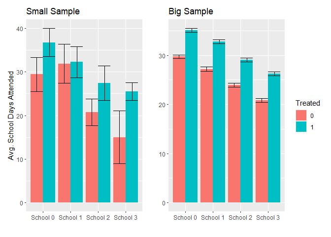
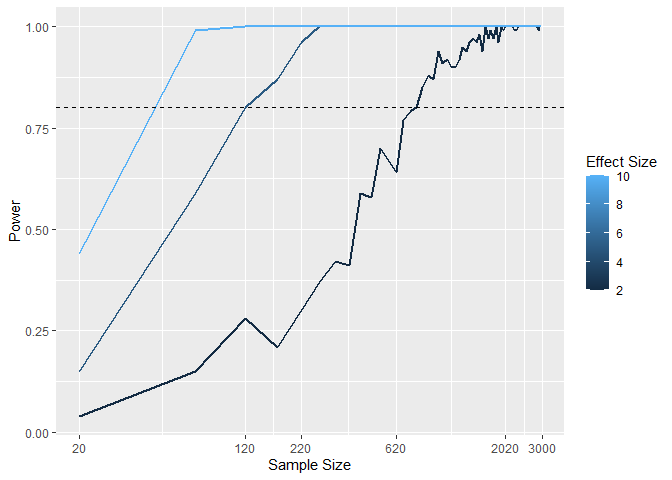

Statistical Power Ex
================

``` r
library(tidyverse)
```

    ## ── Attaching core tidyverse packages ──────────────────────── tidyverse 2.0.0 ──
    ## ✔ dplyr     1.1.2     ✔ readr     2.1.4
    ## ✔ forcats   1.0.0     ✔ stringr   1.5.0
    ## ✔ ggplot2   3.4.2     ✔ tibble    3.2.1
    ## ✔ lubridate 1.9.2     ✔ tidyr     1.3.0
    ## ✔ purrr     1.0.1     
    ## ── Conflicts ────────────────────────────────────────── tidyverse_conflicts() ──
    ## ✖ dplyr::filter() masks stats::filter()
    ## ✖ dplyr::lag()    masks stats::lag()
    ## ℹ Use the conflicted package (<http://conflicted.r-lib.org/>) to force all conflicts to become errors

``` r
library(patchwork)
```

    ## Warning: package 'patchwork' was built under R version 4.3.3

``` r
library(stargazer)
```

    ## Warning: package 'stargazer' was built under R version 4.3.1

    ## 
    ## Please cite as: 
    ## 
    ##  Hlavac, Marek (2022). stargazer: Well-Formatted Regression and Summary Statistics Tables.
    ##  R package version 5.2.3. https://CRAN.R-project.org/package=stargazer

``` r
library(scales)
```

    ## 
    ## Attaching package: 'scales'
    ## 
    ## The following object is masked from 'package:purrr':
    ## 
    ##     discard
    ## 
    ## The following object is masked from 'package:readr':
    ## 
    ##     col_factor

``` r
library(broom)
```

``` r
# Custom chart function to create a dodged bar chart with error bars
custom_chart <- function(data) {
  # Group data by School and W (treatment indicator)
  data_summary <- data %>%
    group_by(School, W) %>%
    summarize(
      # Count the number of observations in each group
      n = n(),
      # Calculate the mean Days_Attended for each group
      m = mean(Days_Attended),
      # Calculate standard error (standard deviation divided by square root of n)
      se = sd(Days_Attended) / sqrt(n)
    )
  
  # Createggplot object with aes for x (School), y (mean Days_Attended), and fill (W)
  ggplot_object <- ggplot(data_summary, aes(x = School, y = m, fill = W))
  
  # Add dodged bar geom with position adjusted for dodging
  ggplot_object <- ggplot_object + geom_col(position = position_dodge(.9))
  
  # Add error bars with ymin and ymax based on mean +/- standard error, with dodging
  ggplot_object <- ggplot_object + geom_errorbar(aes(ymin = m - se, ymax = m + se), position = position_dodge(.9))
  
  return(ggplot_object)
}
```

``` r
data_gen_func <- function(effect_size, sample_size) {
  # Generate data with schools, treatment indicator, and random noise
  data <- tibble(
    School = sample(0:3, sample_size, replace = TRUE),  # 4 Schools
    W = sample(0:1, sample_size, replace = TRUE)       # Treatment indicator
  ) %>%
    mutate(
      Days_Attended = 30 + effect_size * W - 3 * School + rnorm(sample_size, mean = 0, sd = 10),
      # Avg days with effect size & school influence, plus random noise
      School = paste("School", School) %>% as.factor(),  # Convert school to factor
      W = as.factor(W)                                    # Convert treatment indicator to factor
    )
  return(data)
}

# Generate data for small and large sample sizes with treatment effect
small_n <- data_gen_func(5, 50)
big_n <- data_gen_func(5, 5000)

# Create charts for small and large samples using custom_chart function
small_n_chart <- small_n %>% custom_chart() + 
  labs(title = "Small Sample", y = "Avg. School Days Attended", x = "", fill = "Treated")
```

    ## `summarise()` has grouped output by 'School'. You can override using the
    ## `.groups` argument.

``` r
big_n_chart <- big_n %>% custom_chart() + 
  labs(title = "Big Sample", y = "", x = "", fill = "Treated")
```

    ## `summarise()` has grouped output by 'School'. You can override using the
    ## `.groups` argument.

``` r
# Combine the charts with a single legend using plot_layout
small_n_chart + big_n_chart + plot_layout(guides = "collect")
```

<!-- -->

``` r
# Define the formula for the linear regression model
analysis_formula <- 'Days_Attended ~ W + School'

# Function to estimate the linear model for a given data set
estimator_func <-  function(data) lm(as.formula(analysis_formula), data = data)

# Generate data and estimate linear models for small and large data sets
small_n <- data_gen_func(5,50) %>%
    estimator_func()
big_n <- data_gen_func(5,5000) %>% 
    estimator_func()

# Use stargazer to create a table comparing the two fitted models
stargazer(small_n,big_n,align=TRUE,type="text")
```

    ## 
    ## ===================================================================
    ##                                   Dependent variable:              
    ##                     -----------------------------------------------
    ##                                    analysis_formula                
    ##                              (1)                     (2)           
    ## -------------------------------------------------------------------
    ## W1                        10.523***               4.876***         
    ##                            (3.217)                 (0.282)         
    ##                                                                    
    ## SchoolSchool 1             -4.117                 -2.895***        
    ##                            (4.293)                 (0.396)         
    ##                                                                    
    ## SchoolSchool 2             -2.402                 -6.221***        
    ##                            (3.893)                 (0.396)         
    ##                                                                    
    ## SchoolSchool 3            -12.445**               -8.970***        
    ##                            (4.646)                 (0.400)         
    ##                                                                    
    ## Constant                  25.937***               30.382***        
    ##                            (3.217)                 (0.314)         
    ##                                                                    
    ## -------------------------------------------------------------------
    ## Observations                 50                     5,000          
    ## R2                          0.266                   0.149          
    ## Adjusted R2                 0.201                   0.148          
    ## Residual Std. Error   10.639 (df = 45)        9.952 (df = 4995)    
    ## F Statistic         4.073*** (df = 4; 45) 217.875*** (df = 4; 4995)
    ## ===================================================================
    ## Note:                                   *p<0.1; **p<0.05; ***p<0.01

``` r
alpha <- 0.05

# Function to check if a model coefficient's p-value is statistically significant
discriminator_func <- function(model) tidy(model)$p.value[2] <= alpha

# Check for statistically significant treatment effect in each model
small_n <- data_gen_func(5,50) %>%
    estimator_func() %>% 
    discriminator_func()
big_n <- data_gen_func(5,5000) %>% 
    estimator_func() %>% 
    discriminator_func()
paste("Able to detect effect with small sample size?",small_n)
```

    ## [1] "Able to detect effect with small sample size? TRUE"

``` r
paste("Able to detect effect with large sample size?",big_n)
```

    ## [1] "Able to detect effect with large sample size? TRUE"

``` r
# Function to calculate statistical power through simulation
calc_power <- function(data_generator,estimator,discriminator,num_sims=500) {
  
  # Initialize an empty vector to store significance results from simulations
  sig_results <- c()
  
  # Run simulations (number of simulations defined by num_sims)
  for (i in 1:num_sims) {
    # Generate a new dataset for each simulation (prevents data reuse)
    mock_data <- data_generator()
    # Run the analysis
    model <- estimator(mock_data)
    # Check for statistically significant treatment effect using the discriminator function
    sig_results[i] <- discriminator(model)
  }
  # Calculate power: proportion of simulations with significant results (mean of sig_results)
  sig_results %>%
    mean() %>%
    return()
}

# These are functions that, when called, return the result of the data generator with those parameters
small_n_generator <- function() data_gen_func(5,50)
big_n_generator <-  function() data_gen_func(5,5000)
small_n_power <- calc_power(
    small_n_generator,
    estimator_func,
    discriminator_func) * 100 %>% round(2)
big_n_power <- calc_power(
    big_n_generator,
    estimator_func,
    discriminator_func) * 100 %>% round(2)
paste0("Able to correctly detect effect with small sample size ",small_n_power,"% of the time.")
```

    ## [1] "Able to correctly detect effect with small sample size 39.8% of the time."

``` r
paste0("Able to correctly detect effect with large sample size ",big_n_power,"% of the time.")
```

    ## [1] "Able to correctly detect effect with large sample size 100% of the time."

``` r
# STUDY DESIGN 

# Define effect sizes to be tested (here, 2, 5, and 10)
effect_sizes <- c(2,5,10)

# Define a sequence of sample sizes to explore (from 20 to 3000, increasing by 50)
sample_sizes <- seq(20, 3000, by = 50)

# Create a dataframe with each effect size (es) and sample size (ss) pair
params <- expand.grid(list(es=effect_sizes,ss=sample_sizes))

# Helper function to create a data generator function for a specific effect size and sample size
create_generator <- function(es,ss) function() data_gen_func(es,ss)
data_generators <- mapply(create_generator,
    params$es,params$ss)

# Simulation constants
power_thresh <- 0.80
num_sims_p_step <- 100
    
# Calculate statistical power for each combination using the calc_power function
power_res <- mapply(
    calc_power,
    data_generators,
    MoreArgs=list(
        estimator = estimator_func,
        discriminator = discriminator_func,
        num_sims = num_sims_p_step)
    )
results <- params  %>% mutate(power = power_res)

# Create a ggplot to visualize power vs sample size for each effect size
ggplot(results,
     aes(x = ss, y = power,group=es,color=es)) +
     geom_line(size=1) +
     # add a horizontal line at 90%
     geom_hline(aes(yintercept = power_thresh), linetype = 'dashed') + 
     scale_x_continuous(trans = log_trans(),breaks=c(20,120,220,620,2020,3000)) +
     labs(x = 'Sample Size', y = 'Power',color='Effect Size')
```

    ## Warning: Using `size` aesthetic for lines was deprecated in ggplot2 3.4.0.
    ## ℹ Please use `linewidth` instead.
    ## This warning is displayed once every 8 hours.
    ## Call `lifecycle::last_lifecycle_warnings()` to see where this warning was
    ## generated.

<!-- -->

Conclusion: 1. Statistical power is dramatically impacted by sample
size. With a small sample (n = 50), the ability to detect a significant
treatment effect was only 38.8%. However, with a large sample (n =
5000), this detection rate increased to 100%.

2.  Simulations reveal the relationship between sample size, effect
    size, and power. Increasing sample size consistently leads to higher
    power for a given effect size. Larger effect sizes also require
    smaller sample sizes to achieve the same level of power.

3.  Visualizing power curves aids in study design optimization. By
    plotting power against sample size for different effect sizes,
    researchers can determine the minimum sample size needed to achieve
    a desired level of power (e.g., 80%).
